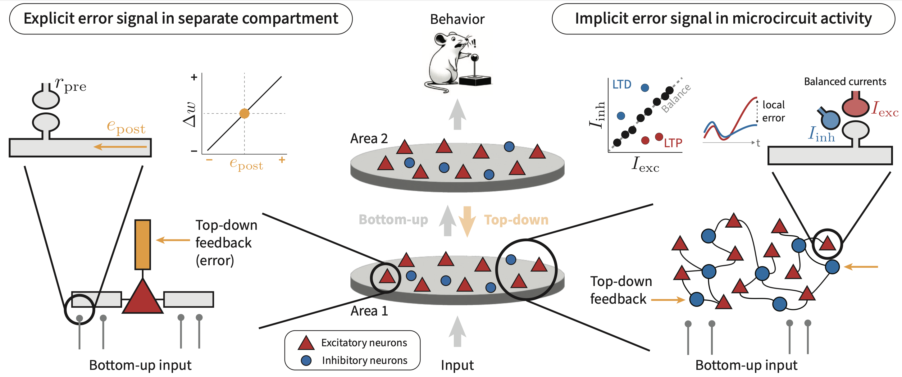

# Breaking Balance: Encoding local error signals in perturbations of excitation–inhibition balance



This repository contains all code and scripts used to generate the numerical results and figures in our preprint
[**"Breaking Balance: Encoding local error signals in perturbations of excitation–inhibition balance"**](placeholder).


[](placeholder)

---

## BibTex Citation

If you use any of this code or build upon this work, please cite:

```bibtex
@article{rossbroich_breaking_2025,
  title={Breaking Balance: Encoding local error signals in perturbations of excitation–inhibition balance},
  author={Julian Rossbroich and Friedemann Zenke},
  year={2025},
  eprint={XXXXXXX},
  archivePrefix={bioRxiv},
  journal={bioRxiv},
  doi={10.1101/XXXXXXX}
}
```

## Installation

Follow these steps to reproduce our results in a clean Python 3.11.8 environment. This project relies on **JAX** and **Diffrax** for JIT-compiled ODE solving. 
For large-scale simulations (e.g., vision benchmarks), GPU support is required.

### Prerequisites

* **Python**: 3.11.8
* **CUDA**/CUDNN: Match your hardware (see [JAX install guide](https://github.com/google/jax#installation)).

---

### Option 1: Conda Environment

Create and activate a new environment from our `environment.yml`:
```bash
conda env create --file environment.yml --name <YOUR_ENV_NAME>
conda activate <YOUR_ENV_NAME>
```
Replace `<YOUR_ENV_NAME>` with your preferred environment name.

---

### Option 2: pip

In a fresh Python 3.11.8 venv, install dependencies:

```bash
pip install -r requirements.txt
```

---

### Local `bcp` package

Install the local code in `bcp/` in edit mode:
```
pip install -e .
```
Or make sure that the project root's `bcp/` folder is on `PYTHONPATH`.

---

### JAX & CUDA Compatibility

We pin to specific versions to maintain compatibility with the dependencies we use

* `jax`      : 0.4.25
* `jaxlib`   : 0.4.25
* CUDA plugin: 11.8

> **Note:** Newer JAX releases may break legacy `diffrax`/`flax` APIs. Ensure your CUDA/CUDNN build matches these versions. You might need to change to the CUDA 12 plugin.

For detailed GPU installation instructions, refer to the official [JAX installation guide](https://github.com/google/jax#installation).


## Usage examples

We provide a number of jupyter notebooks and scripts to replicate the numerical results presented in the paper.
We use [`hydra`](https://github.com/facebookresearch/hydra) for experiment logging and configuration. 
Refer to the commands [simulations.md](simulations.md) file to find the exact commands replicating the results from the paper.

### Figures 2 & 3: Single assembly experiments

All figure panels containing simulation results in Figures 2 & 3 can be replicated by running the corresponding figure notebook inside the `notebooks` folder.

### Figures 4, 5 and S2: Trajectory learning

Simulations for the trajectory learning task are run by calling the `run_traj.py` script:
```
python run_traj.py vf.perc_overlap=0
```
where the `vf.perc_overlap` argument refers to the percentage of assembly overlap (see main text).

### Figure 6: Fashion-MNIST

To train networks with multiple hidden layers on Fashion-MNIST, run the `run_static.py` script. For example,
```
python run_static.py +dataset=fmnist model.vf.nb_hidden=1 epochs=50
```
trains a network with a single hidden layer for 50 epochs.
Please refer to the [simulations.md](simulations.md) file for the exact commands we used to generate the data reported the paper.

### Figure 7: Fear conditioning task
To train E/I assembly networks on a task mimicking fear conditioning in the BLA (see [Krabbe et al., 2019](https://www.nature.com/articles/s41593-019-0508-y)), use the `run_fearcond.py` script.
```
python run_fearcond.py 
```

### Figure 8: Motor learning task

To train E/I assembly networks on a task mimicking the motor learning task described in [Ren et al., 2022](https://doi.org/10.1016/j.neuron.2022.04.031)), use the `run_motor.py` script:
```
python run_motor.py 
```

### Changing simulation parameters
In general, all relevant simulation parameters can be be overridden using the same syntax as above or by changing the relevant configuration files in the `conf` directory (refer to the [hydra documentation]( https://hydra.cc/) for details).

## Hardware & Performance

- **GPU:** NVIDIA card with CUDA ≥ 11.3 and ≥ 16 GB memory recommended. We used NVIDIA RTX A4000 and Quadro RTX 5000 GPUs.
- **RAM**: ≥ 16 GB for large simulations

## License

This project is licensed under the MIT License. See [LICENSE](LICENSE) for details.
