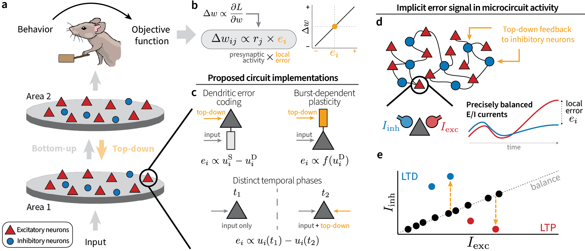

# Encoding local error signals by breaking the balance of excitation and inhibition



Code for all simulations and figures in our paper "Encoding local error signals by breaking the balance of excitation and inhibition".

```bibtex
@article{rossbroich_breaking_2026,
  title={Encoding local error signals by breaking the balance of excitation and inhibition},
  author={Julian Rossbroich and Friedemann Zenke},
  year={2026},
  journal={Nature Communications},
}
```

## Install

#### Option 1: `uv`

We use [uv](https://docs.astral.sh/uv/). From the repo root:

```bash
uv sync --locked
```

This creates `.venv/` with Python 3.11.8, installs `bcp` in editable mode, and installs the dependencies in `uv.lock`. Run scripts with `uv run python run_traj.py ...` or activate the venv first.

#### Option 2: `venv` and `pip`

A plain Python 3.11 venv works too:

```bash
python3.11 -m venv .venv
source .venv/bin/activate
python -m pip install --upgrade pip
python -m pip install -r requirements.txt -e .
```

**GPU runs:** Both options install CPU JAX by default. On Linux with an NVIDIA GPU, add the CUDA 12 packages while retaining the locked JAX version:

```bash
# uv environment; use uv run --no-sync for GPU scripts
uv pip install -c requirements.txt "jax[cuda12]"

# pip environment
python -m pip install -c requirements.txt "jax[cuda12]"
```

See the [JAX install guide](https://docs.jax.dev/en/latest/installation.html) for driver requirements.

## Reproducing the figures

Every figure has a notebook in `notebooks/` that reads simulation output from `out/` and writes figure PDFs to `figures/`. There are two ways to get the data:

1. **Run the simulations yourself.** [simulations.md](simulations.md) lists the exact command for every figure. Configs live in `conf/` (we use [Hydra](https://hydra.cc/)) if you want to change hyperparameters.
2. **Download precomputed simulation output.** The full `out/` folder is available at [LINK TBD](#). Unpack it into the repo root and run the notebooks.

Most simulations run fine on a CPU and take minutes to days. Figures 6 and 7 need a GPU (we used NVIDIA RTX A4000 and Quadro RTX 5000, 16 GB) and several days to run in full.

## License

MIT, see [LICENSE](LICENSE).
